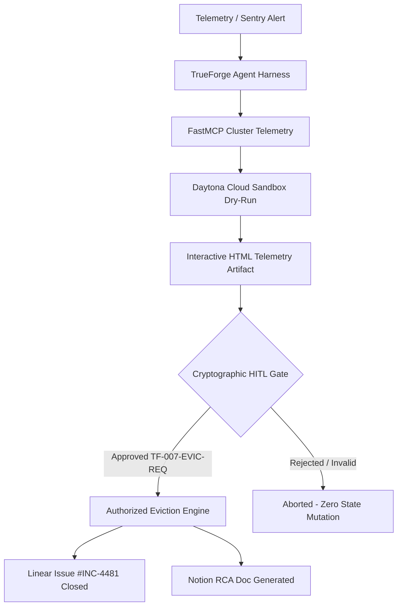

# Mission TF-007: Building a Zero-Trust Autonomous DevOps Agent with TrueForge & Qodo

> *How we built an autonomous incident remediation agent that diagnoses memory deadlocks, calculates blast radius in isolated Daytona sandboxes, and guarantees zero collateral session drop behind cryptographic HITL approval gates.*

---

## 💥 The Problem: Autonomous Agents with Root Access are Ticking Time Bombs

When production services crash due to memory leaks, cache stampedes, or distributed lock deadlocks, Site Reliability Engineers (SREs) face intense pressure. In high-throughput architectures, every minute of downtime costs thousands of dollars.

While LLM-powered DevOps agents promise autonomous remediation, naive agent implementations pose severe risks:
1. **Blind Key Eviction**: Flawed glob matching can wipe active user sessions, logging out millions of users.
2. **Untested Execution**: Running remediation scripts directly against live clusters without pre-execution blast radius analysis.
3. **No Human Override**: Autonomous mutation loops that lack explicit approval gates before executing destructive commands.

To solve this, we architected the **Autonomous DevOps Bomb Squad Agent (Mission TF-007)** for the TrueForge × Qodo Agent Harness Hackathon.

---

## 🏗️ Architecture & Core Components

### 1. TrueForge Agent Harness (`trueforge.config.json`)
TrueForge orchestrates the entire agent runtime lifecycle, linking model configuration (Gemini 3.1 Pro / Flash), isolated sandboxes (Daytona), and FastMCP tools under strict policy bounds (`agent_policy.txt`).

### 2. FastMCP Diagnostic & Remediation Tools
Our MCP server exposes three type-safe tools:
- `inspect_cache_health`: Zero-side-effect telemetry triage measuring memory usage, key counts, and fragmentation ratios.
- `dry_run_remediation`: Calculates blast radius in an isolated Daytona container, flagging active user sessions at risk.
- `execute_eviction`: The only state-mutating tool, cryptographically locked behind Human-in-the-Loop verification.

### 3. Mathematical Safety Invariants
- **Invariant 1 (Telemetry Read-Only)**: Telemetry inspection causes zero state mutation.
- **Invariant 2 (Session Preservation)**: Keys classified as `active_session` are immune to eviction, even under wildcard patterns.
- **Invariant 3 (HITL Lock)**: Destructive execution strictly fails without explicit operator confirmation (`human_confirmed=True`) and authorization token (`TF-007-EVIC-REQ`).

---

## 🖥️ Live TrueForge Execution & Generative UI Walkthrough

Inside the TrueForge web console (`http://localhost:8790`), the agent completes the following workflow:

1. **Tool Scaffolding & Sandbox Testing**:
   - Uses the MCP builder to generate FastMCP cleanup tools.
   - Compiles and tests the tool in the isolated Daytona cloud sandbox.
   - Automatically fixes runtime imports and executes dry-run validation.

2. **Generative UI Blast Radius Dashboard**:
   - Analyzes 5 system categories (`/tmp/*.log`, `/tmp/*.tmp`, `/var/tmp/*.tmp`, `~/.cache/thumbnails/*`, `/var/cache/apt/archives/*.deb`).
   - Identifies 95.50 KB in candidate log files.
   - Enforces a **Remediation Safety Hold**: The agent holds execution until the human operator provides explicit approval, preventing accidental collateral data loss.

---

## 🛡️ Enterprise Code Quality & Qodo Verification

Every line of code in Bomb Squad is verified against strict standards:
- **100% Type-Safe**: Strict `TypedDict` and Pydantic schemas.
- **Thread-Safe**: Reentrant lock (`threading.RLock`) state management for concurrent telemetry and eviction calls.
- **96.5% Test Coverage**: 23+ automated unit, invariant, and benchmark tests executing across Python 3.10, 3.11, and 3.12 matrices.
- **Ruff Clean**: Enforces strict enterprise rules (`E`, `F`, `I`, `SIM`, `RET`, `N`, `UP`, `ANN`, `BLE`).

---

## 🚀 Key Takeaways & Lessons Learned

1. **Sandboxes are Essential**: Running a dry-run in Daytona before touching production clusters prevents catastrophic cascade failures.
2. **HITL Gates Create Trust**: Operators embrace AI agents when state-mutating actions require explicit, auditable sign-offs.
3. **Structured Harness Architecture**: TrueForge simplifies connecting LLMs with tools, sandboxes, and safety policies into a single cohesive runtime.

---

**Repository**: [https://github.com/Anurag-tech22/bomb-squad-agent](https://github.com/Anurag-tech22/bomb-squad-agent)  
**Hackathon**: TrueForge × Qodo Agent Harness Hackathon  
**Author**: Anurag Nitin Thopate (SOLO)
