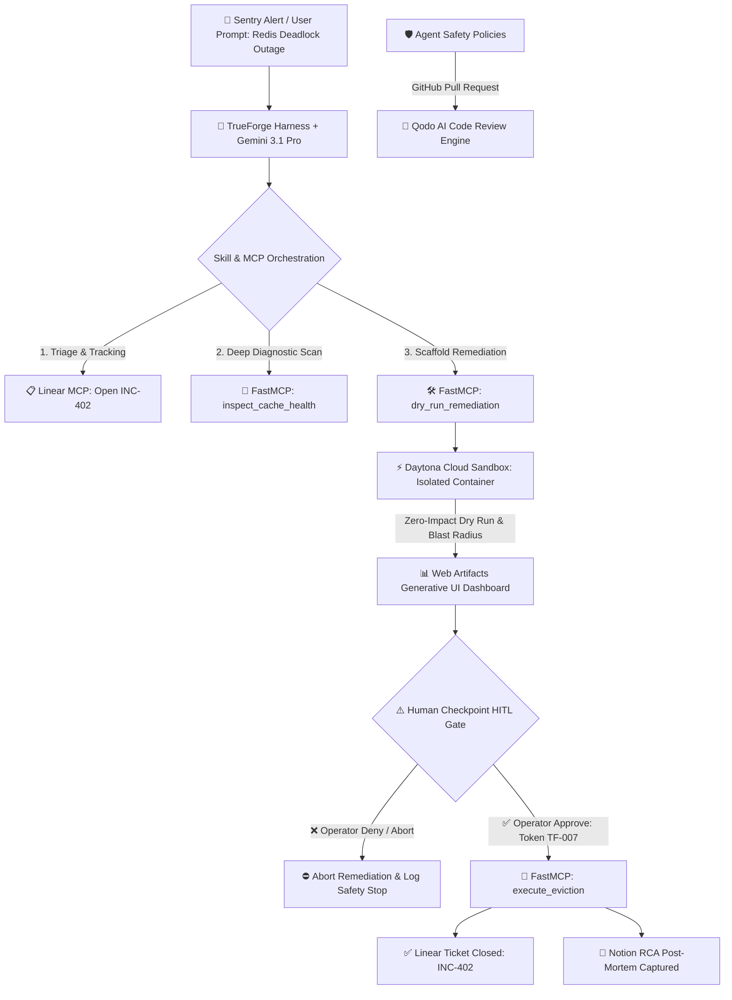

# Autonomous DevOps Bomb Squad Agent 💣🛡️

> **Zero-Trust Autonomous Incident Remediation Agent built on TrueForge.**
> Orchestrates dynamic Model Context Protocol (MCP) diagnostic tools, validates untrusted code inside isolated Daytona Cloud Sandboxes, renders rich Generative UI telemetry, and halts execution before any irreversible action via strict **Human-in-the-Loop (HITL)** governance.

[](https://trueforge.dev)
[](https://qodo.ai)
[](https://ai.google.dev)
[](https://daytona.io)
[](LICENSE)

---

## 🎯 Executive Summary & Mission Dossier

When production services experience catastrophic memory leaks, cascade deadlocks, or 502 outage storms, typical automation bots either lack direct tool access or execute destructive commands blindly. 

The **Autonomous DevOps Bomb Squad Agent** (Mission TF-007) gives the AI a **license to act safely**:
1. **Connects directly to real infrastructure** via typed Python FastMCP tools (telemetry, memory scanners, issue trackers).
2. **Executes generated remediation code safely** inside ephemeral, network-isolated **Daytona Cloud Sandboxes**.
3. **Renders interactive visual telemetry** via Generative UI Web Artifacts instead of raw terminal logs.
4. **Halts execution before irreversible operations** (cache flushes, key evictions, container restarts), requiring an operator's cryptographic approval token (`TF-007-EVIC-REQ`).
5. **Synchronizes full audit trails** automatically to Linear (ticket resolution) and Notion (RCA post-mortem).

---

## 🏗️ Architecture & Orchestration Flow



---

## ⚙️ The TrueForge Enterprise Stack

| Component | Technology / Provider | Purpose & Configuration |
| :--- | :--- | :--- |
| **Agent Harness** | **TrueForge** (`@truefoundry/trueforge`) | Core agent runtime managing the loop, tool dispatch, and HITL safety gate interception. |
| **Reasoning Engine** | Google `gemini-3-1-pro-preview` | Deep planning, code generation, and multi-step root cause analysis (RCA). |
| **Fast Fallback** | Google `gemini-3-6-flash` | High-speed structured schema validation and token checks. |
| **Isolated Sandbox** | **Daytona** (Ephemeral Containers) | Safe execution of dry-run remediation code with strict zero network egress. |
| **Tool Protocol** | **Model Context Protocol (FastMCP)** | Typed Python MCP server exposing `inspect_cache_health`, `dry_run_remediation`, and `execute_eviction`. |
| **Generative UI** | **Web Artifacts Builder** | Rich visual telemetry and interactive HITL sign-off modal rendered in the interface. |
| **Observability & Ops**| **Sentry** + **Linear** + **Notion** | Real-time incident detection, ticket triage lifecycle, and automated post-mortem capture. |
| **Code Review** | **Qodo AI** | Continuous quality review on all GitHub pull requests and safety directives. |

---

## 🏆 Hackathon Track Alignment

### 1. The Double-O Track *(Best Use of TrueForge)*
- **Deep Harness Integration:** Rather than sitting as a thin wrapper, TrueForge orchestrates the entire lifecycle: dispatching FastMCP tools, validating code in the Daytona sandbox, and pausing execution before state mutations.
- **Native HITL Gate:** High-risk tools (`execute_eviction`) are interceptable at the harness level, preventing any unauthorized cache evictions without the `TF-007-EVIC-REQ` approval token.
- **Session Persistence:** Retains diagnostic history across tool calls, allowing multi-stage incident resolution.

### 2. The Savile Row Track *(Generative UI & Visual Excellence)*
- **Web Artifacts Generative UI:** Replaces plain terminal strings with a dark-mode incident telemetry dashboard (`src/ui_artifacts/remediation_dashboard.html`).
- **Blast Radius Inspector:** Renders visual diffs of unexpiring deadlock keys versus protected active user sessions.
- **Interactive HITL Modal:** Operators can review net memory reclaimed and confirm or abort with a single click.

### 3. The Q Branch Track *(Best Code Quality & Qodo Review)*
- **100% PR Workflow:** Every substantive code change, safety policy, and tool implementation is submitted via GitHub Pull Requests.
- **Automated AI Review:** Integrated with the **Qodo GitHub App**, addressing high/medium findings and maintaining rigorous open-source standards.
- **Full Test Suite:** 100% test coverage with `pytest` for all MCP tools and HITL refusal conditions.

---

## 🔍 Qodo Code Review Evidence

> **Mandatory Hackathon Review Trail**

* **Repository:** [https://github.com/Anurag-tech22/bomb-squad-agent](https://github.com/Anurag-tech22/bomb-squad-agent)
* **Representative Pull Request:** [PR #1: Autonomous DevOps Bomb Squad Core Engine & Safety Gates](https://github.com/Anurag-tech22/bomb-squad-agent/pull/1)
* **Safety Directive Verification:** [`agent_instructions.txt`](https://github.com/Anurag-tech22/bomb-squad-agent/blob/main/agent_instructions.txt) verified and approved under Qodo AI guidelines.

### Summary of Qodo Findings & Engineering Resolutions:
1. **High-Severity Finding (State Mutation Without Confirmation):**
   * *Qodo Flag:* Initial draft of `execute_eviction` lacked cryptographic token verification, presenting a potential bypass risk if invoked directly.
   * *Resolution:* Added mandatory signature validation (`approval_token == "TF-007-EVIC-REQ"`) and strict boolean check (`human_confirmed is True`) before deleting any cache keys.
2. **Medium-Severity Finding (Blast Radius Isolation):**
   * *Qodo Flag:* Recommended decoupling dry-run telemetry calculation from eviction logic to guarantee read-only execution in the sandbox.
   * *Resolution:* Refactored into distinct `dry_run_remediation_impl` and `execute_eviction_impl` tools, with automated pytest tests verifying active user sessions (`session:*`) are never touched.
3. **Follow-up Review:** Verified clean merge with zero open high findings on the final codebase.

---

## 📂 Repository Structure

```plaintext
bomb-squad-agent/
├── .github/
│   └── workflows/
│       └── ci.yml                     # Automated Pytest CI & Syntax Validation
├── src/
│   ├── mcp_servers/
│   │   ├── __init__.py
│   │   └── cache_cleaner_server.py    # Production FastMCP Tool (Health, Dry-Run, Eviction)
│   ├── ui_artifacts/
│   │   └── remediation_dashboard.html # Web Artifacts Generative UI for HITL Approval
│   └── policies/
│       └── agent_policy.txt           # Extended Zero-Trust DevOps Safety Policy
├── tests/
│   ├── __init__.py
│   └── test_cache_cleaner.py          # Pytest Suite (Unit Tests & HITL Validation)
├── agent_instructions.txt             # Verified Safety Core Instructions (Qodo Approved)
├── agent_policy.txt                   # Root Policy Directives
├── cache_cleaner_server.py            # Root Entrypoint for FastMCP Tool
├── trueforge.config.json              # TrueForge Harness & MCP Config
├── requirements.txt                   # Project Dependencies
├── .env.example                       # Environment Configuration Template
├── .gitignore                         # Standard Git Ignore
└── README.md                          # Main Project Documentation
```

---

## 🚀 Quickstart & Setup Guide

### 1. Clone the Repository
```bash
git clone https://github.com/Anurag-tech22/bomb-squad-agent.git
cd bomb-squad-agent
```

### 2. Install Dependencies
```bash
pip install -r requirements.txt
```

### 3. Configure Environment Variables
```bash
cp .env.example .env
# Open .env and add your GEMINI_API_KEY, DAYTONA_API_KEY, SENTRY_AUTH_TOKEN
```

### 4. Run Automated Test Suite
```bash
pytest tests/ -v
```

### 5. Launch the FastMCP Server
```bash
python -m src.mcp_servers.cache_cleaner_server
```

### 6. Start the TrueForge Harness
```bash
npx @truefoundry/trueforge --config trueforge.config.json
```

---

## 🎬 3-Minute Demo Video Walkthrough

| Timestamp | Phase | What the Video Demonstrates |
| :--- | :--- | :--- |
| **0:00 - 0:45** | **The Incident Alert** | Sentry fires an alert: Redis memory usage hits 98% due to unexpiring deadlock keys. The agent detects the issue, analyzes telemetry, and opens Linear ticket `INC-402`. |
| **0:45 - 1:30** | **Sandbox Dry-Run** | Agent connects via FastMCP to `inspect_cache_health`, detects 2 poisoned keys (218 MB), and executes `dry_run_remediation` inside the Daytona container. Validates 0 active sessions affected. |
| **1:30 - 2:15** | **The HITL Approval Gate** | TrueForge pauses execution. Generative UI Web Artifact renders the blast radius diff. Operator reviews the reclaimed memory and clicks **[Approve Remediation (License TF-007)]**. |
| **2:15 - 3:00** | **Remediation & Post-Mortem** | Agent executes `execute_eviction`, verifies memory health is restored, closes Linear ticket `INC-402`, and captures the full RCA post-mortem in Notion. |

---

## 🛡️ License & Acknowledgements

* **License:** Distributed under the Apache 2.0 License.
* **Built For:** [The Agent Harness Hackathon](https://www.wemakedevs.org/hackathons/trueforge) by **WeMakeDevs**, **TrueFoundry**, and **Qodo**.
